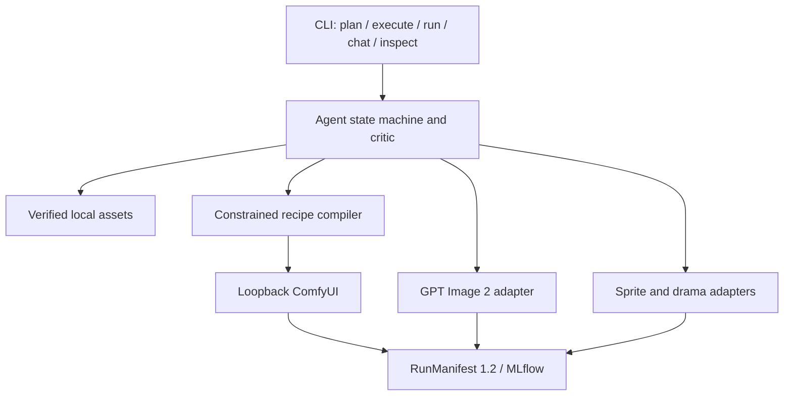

# Agent-first Architecture

LetsAIGC is an Agent-driven game-asset generation workbench. The Development
Harness controls repository development; it is never imported or executed by the product.

## Dependency and authority rules

- Runtime dependency direction is CLI → Agent → deterministic tools → backends → evidence.
- `.agents`, `.specify`, `AGENTS.md`, and `specs` are not runtime dependencies.
- The Agent emits structured plans, not shell commands or arbitrary ComfyUI graphs.
- Pre-approval work is limited to input resolution, read-only diagnostics, capability
  inspection, and planning. Generation requires an exact plan fingerprint.
- An approved envelope fixes backend, model, recipe, output count, maximum size,
  quality/steps, allowed tools, and per-iteration/total budgets.
- Automatic revisions may change only prompt, negative prompt, seed, and
  recipe-declared tunables. Material changes require a new plan and approval.
- Model download, training, human approval, and production export remain explicit expert actions.

## Compatibility

The existing `models`, `comfy`, `workflow`, `video`, `sprites`, `drama`, `train`,
`eval`, `tracking`, `review`, `export`, and `runpack` commands remain deterministic
expert interfaces. Agent tools wrap a strict subset; they do not replace these commands.
