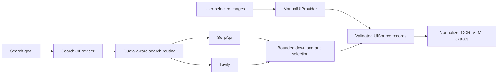

# UI providers (planned)

Status: architecture and implementation contract. The provider registry, manual
intake commands and search integration are not implemented yet.

`UIProvider` supplies validated UI screenshot sources to the analysis workflow.
Its implementations are `ManualUIProvider` (`manual`) and `SearchUIProvider`
(`search`). Both return `UIProvisionResult` containing `UISource` records with
immutable image and provenance ArtifactRefs. Normalization, OCR, VLM layout
analysis, extraction and approved reconstruction consume this shared contract.

## Manual input

Accept explicitly selected local PNG/JPEG/WebP files, HTTPS image URLs and
authorized existing artifact references. The final batch supports up to ten images;
the first M-U1 integration covers a single manual image. CLI intake is the first
interface. Future file pickers or upload controls should reuse that intake service.

Trusted intake resolves paths/URLs, validates bytes and stores task-scoped snapshots
before constructing the workflow request. `ManualUIInput` carries 1-10 ArtifactRefs
and optional metadata references, never arbitrary paths or raw signed URLs in
Temporal history. Preserve existing AssetResolver single-image safeguards and its
legacy eight-image `resolve_many` contract; apply the UI batch limit in UI intake.
Validate the UI pixel limit as well as format, byte limit and artifact integrity.

Replaying a task uses the frozen copies, even if an original file or URL changes.
Cross-task references require scope/access validation and task-local lineage.
Importing inputs does not start paid analysis or approve a reconstruction operation.

User-selected images skip search ranking and the search default of one selected
candidate. Exact duplicates may reuse storage and processing, with every submitted
source mapped to a result; near duplicates must not be silently discarded. Record
per-input failures and partial batches. Reject excess inputs before starting work.

Manual intake invokes neither image-search APIs nor quota probes and requires no
search credentials. HTTPS imports still use controlled network fetching. Subsequent
VLM, segmentation and generation retain their own budgets and approval requirements.
An invalid manual image does not implicitly authorize a web search.

## Contract and provenance

Use a discriminated `UIInputSpec` with `ManualUIInput` or `SearchUIInput`, held in
`UIAnalysisRequest.input`. Move its provisional top-level query into SearchUIInput
so conflicting manual and search arguments cannot silently change input mode.

`UIProvisionResult` reports provider ID/version, status (`ready`, `partial`, `empty`
or `unavailable`), sources and artifact references for detailed results/errors.
Only acquired and validated images appear in `sources`. Stable source IDs map back
to original submissions. `UIProvenance` distinguishes manual/search origin, actual
acquisition method, optional search backend, sanitized source page, retrieval time,
image hashes and observed dimensions. Long or untrusted metadata lives in artifacts.

Optional user titles, game names, HUD notes and usage claims are `user_declared`;
measured image properties are `observed`. Source pages are metadata, distinct from
image download URLs. User claims do not become verified model observations or
production licenses. Duplicate content keeps all provenance edges without overwriting
manual origins with search origins. Revised inputs/metadata create new versions.

## Search and quota routing

The internal `ImageSearchProvider` interface remains responsible for SerpApi/Tavily
integration. It is below `SearchUIProvider`; these vendors are not alternatives to
`ManualUIProvider` in the quota router. Use `provider_id=search` for the domain
source and `search_backend=serpapi|tavily` for actual search operations.

Search follows the [quota-aware configuration](ui-search-configuration.md), including
shared limits, automatic switching, operation-bound decisions and reconciliation.
Do not serialize transient URLs or full API responses into workflow history.
Source providers reuse the existing ArtifactStore, operation ledger and Temporal
activities rather than introducing another persistence or scheduling stack.

## Implementation and validation

- G01: `schemas/ui_provider.py`, the UI request update, and
  `ui_providers/base.py` / `registry.py` freeze the common contract.
- G02: `ui_providers/intake.py` / `manual.py` integrate existing safe import and
  immutable source storage before canonicalization.
- G06: manual single-image CLI and Temporal integration deliver M-U1.
- G10: `ui_providers/search.py` wraps bounded acquisition and quota routing.
- G11: sequential child workflows accept either source's images; shared budgets,
  per-image failures and cancellation keep the existing semantics.
- G12: cover both sources with contract, recovery and real capability evidence.

Provider tests must assert zero search and quota requests for manual input even when
all search keys are absent or search services are unavailable. Test frozen copies,
tampered references, source lineage, direct-URL sanitization, explicit selection,
duplicate mappings, partial batches and original pixel/coordinate invariants.
Identical bytes from different providers should share canonicalization behavior;
contract tests use fixed downstream observations to compare layout semantics.
Live model/search/GPU acceptance remains separate from these offline tests.
